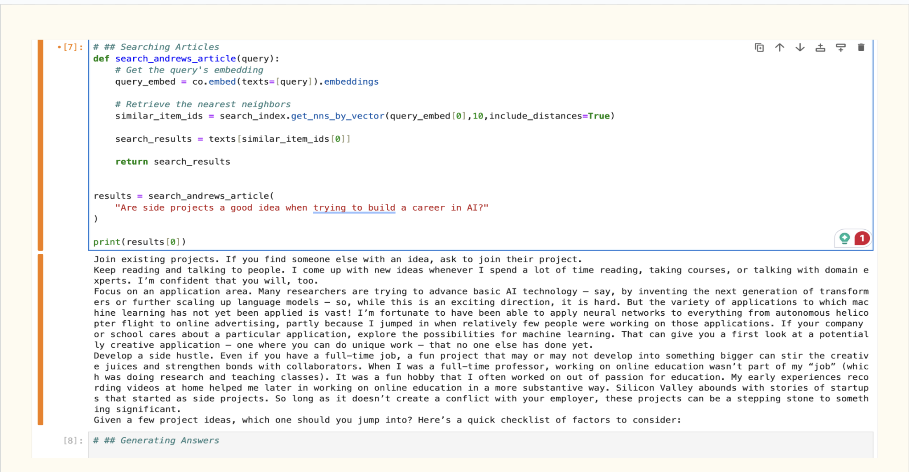
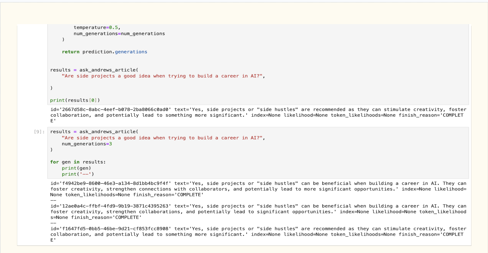

# Generating Answers

## Overview

The **Generating Answers** project demonstrates the use of **Cohere's Language Models** and vector-based **search indexing** to process input text, generate embeddings, and retrieve contextually relevant answers to queries. This project covers the end-to-end pipeline for chunking input text, creating embeddings, building a search index, and generating answers based on test cases.

---

## Features

- **Preprocessing Input Texts**: Split input into chunks and clean up text.
- **Embedding Generation**: Use Cohere's API to create embeddings (vectors) for text.
- **Search Indexing**: Build a vector-based search index using Annoy.
- **Query Handling**: Retrieve the most relevant chunks of text based on a query.
- **Answer Generation**: Generate concise answers to user queries from the retrieved text.
- **Customizable Test Cases**: Validate the system with different types of queries.

---

## How It Works

1. **Input Text Preprocessing**:

   - Split large text into manageable chunks (e.g., paragraphs).
   - Clean up text by removing unnecessary whitespaces and newlines.

2. **Embedding Generation**:

   - Use the `Cohere` API to generate embeddings for the input text.

3. **Search Index Creation**:

   - Build a search index using the `Annoy` library.
   - Add all the embeddings to the search index for fast retrieval.

4. **Search and Retrieval**:

   - Given a query, generate an embedding and find the nearest neighbors in the search index.

5. **Answer Generation**:
   - Formulate a prompt with the retrieved text and query.
   - Use Cohere's **Generate API** to produce a relevant and contextual answer.

---

## Installation

### Clone the repository

```bash
git clone https://github.com/JTasnim/KeywordAndSemanticSearchesWithReRank.git
```

### Set up environment variables

- Create a .env file in the root directory
- Add your Cohere API Key:
  COHERE_API_KEY=<your-cohere-api-key>

---

## Screenshot of execution results




---

## To learn more

[Google Slide](/assets/GeneratorWithSemanticSearch.pptx)
